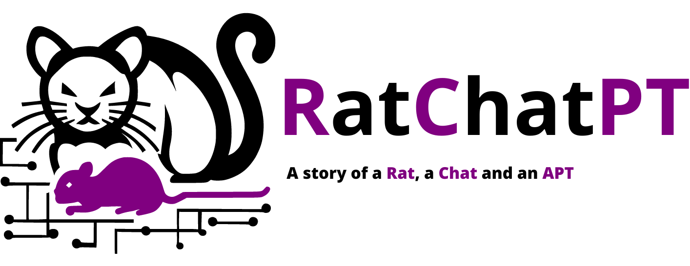
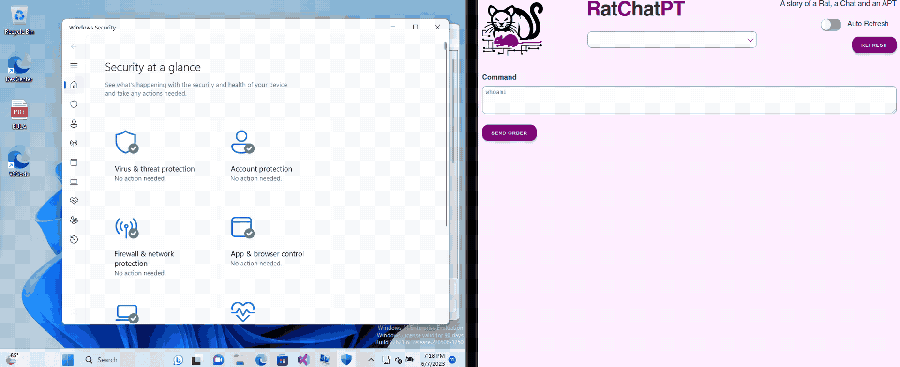

RatChatPT is a POC based on openai's API that can be used by a red team to test the effectivness of your security defense. This POC was created thanks to collaboration between [XRATOR](https://www.x-rator.com/) and [Spartan Conseil](https://spartan-conseil.fr).

**Disclamer** : The usage of RatChatPT and the knowledge shared in this repository is intended for educational and legal purposes only in case for example of red teaming activities. It is designed to assist professionals, authorized individuals, or organizations that are curious about assessing the effectiveness of their security defenses. By using RatChatPT, you acknowledge that it is your responsibility to conduct testing within the boundaries of the law and with proper authorization. The authors assume no liability for any damages or consequences resulting from the use of the Tool. Use RatChatPT at your own risk and always act responsibly, within the boundaries of the law.

You can find all technical explanations here :

- [Article in French](https://www.spartan-conseil.fr/post/c-est-l-histoire-d-un-rat-d-un-chat-et-d-une-apt)
- [Article in English](https://www.conquer-your-risk.com/2023/06/09/ratchatpt-a-red-teams-weapon-powered-by-ai/)

This repository is made up of three parts: the agent code, the handler code and the common code used to call the openai API. 

# Setup

To use it, you need to perform the following tasks:

- clone this repo
- put your bearer in bearer.txt. Be careful, there must be no line breaks (you can use `echo -ne xxx > bearer.txt` to be sure).
- create the certificate with `make certificat`
- compile with `make build`

RatChatPT doesn’t have any dependencies, you only need to have Go 1.20 installed. All binaries can be found in output/

**WARNING** : Your bearer is embedded in both binaries and can be leaked if you use them incorrectly.

# Usage

In the output/ directory, you can launch the Handler binary and open your browser with the url https://127.0.0.1:4443. Your CNC is now operational!

Next, deploy and run the *Agent_XXX* binary on your target. Do not hesitate to refresh the handler web page (the auto refesh is not implemented yet …).